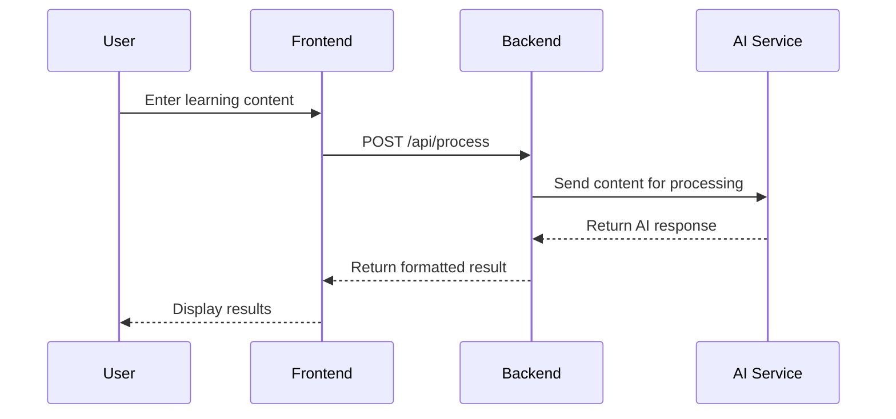

# 🏗️ Architecture

## System Overview

Our application follows a modern three-tier architecture with AI services integration.

```
┌─────────────┐      ┌─────────────┐      ┌─────────────┐
│   Frontend  │ ───▶ │   Backend   │ ───▶ │  AI Service │
│  (HTML/JS)  │ ◀─── │   (Flask)   │ ◀─── │  (OpenAI)   │
└─────────────┘      └─────────────┘      └─────────────┘
                             │
                             ▼
                      ┌─────────────┐
                      │  Database   │
                      │  (Optional) │
                      └─────────────┘
```

## Components

### Frontend Layer

**Technology:** HTML, CSS, JavaScript

**Responsibilities:**
* User interface rendering
* Input validation
* API communication
* Result display

**Key Files:**
* `index.html` - Main UI
* `app.js` - Application logic
* `styles.css` - Styling

---

### Backend Layer

**Technology:** Python, Flask

**Responsibilities:**
* API endpoints
* Request validation
* Business logic
* AI service coordination

**Key Files:**
* `app.py` - Main Flask application
* `ai_service.py` - AI integration
* `requirements.txt` - Dependencies

**API Endpoints:**
```
POST /api/process     - Process user input
POST /api/generate    - Generate content
POST /api/analyze     - Analyze content
GET  /                - Health check
```

---

### AI Service Layer

**Technology:** OpenAI GPT / Google Gemini

**Responsibilities:**
* Natural language processing
* Content generation
* Intelligent analysis

**Integration:**
```python
from openai import OpenAI
client = OpenAI(api_key=API_KEY)

response = client.chat.completions.create(
    model="gpt-3.5-turbo",
    messages=[{"role": "user", "content": prompt}]
)
```

---

## Data Flow

### Request Flow

1. **User Input** → Frontend captures text input
2. **API Call** → Frontend sends POST request to backend
3. **Processing** → Backend validates and prepares data
4. **AI Request** → Backend calls AI service
5. **AI Response** → AI service returns processed data
6. **Transform** → Backend formats response
7. **Display** → Frontend shows results to user

### Example Flow Diagram



---

## Technology Stack

### Frontend
| Technology | Purpose | Version |
|------------|---------|---------|
| HTML5 | Structure | - |
| CSS3 | Styling | - |
| JavaScript | Interactivity | ES6+ |
| Fetch API | HTTP requests | - |

### Backend
| Technology | Purpose | Version |
|------------|---------|---------|
| Python | Language | 3.8+ |
| Flask | Web framework | 3.0.0 |
| Flask-CORS | CORS handling | 4.0.0 |
| python-dotenv | Environment vars | 1.0.0 |

### AI Services
| Service | Use Case | Cost |
|---------|----------|------|
| OpenAI GPT-3.5 | General processing | $0.002/1K tokens |
| OpenAI GPT-4 | Advanced tasks | $0.03/1K tokens |
| Google Gemini | Alternative AI | Free tier available |

---

## Security Considerations

### API Key Protection
* Store in `.env` file (never commit)
* Use environment variables
* Rotate keys regularly

### CORS Configuration
```python
CORS(app, origins=[
    "http://localhost:8000",
    "https://your-domain.com"
])
```

### Input Validation
* Sanitize user input
* Limit request size
* Rate limiting (optional)

---

## Deployment Architecture

### Development
```
Local Machine
├── Frontend: localhost:8000
└── Backend: localhost:5000
```

### Production Options

**Option 1: Simple Deployment**
* Frontend: Vercel/Netlify
* Backend: Render/Railway

**Option 2: Full Stack**
* Frontend: Cloudflare Pages
* Backend: AWS Lambda
* Database: MongoDB Atlas

---

## Performance Optimization

### Frontend
* Minimize HTTP requests
* Async JavaScript loading
* CSS minification
* Image optimization

### Backend
* Response caching
* Connection pooling
* Async operations
* Error handling

### AI Service
* Request batching
* Response caching
* Token optimization
* Fallback models

---

## Scalability

### Current Limitations
* Single server instance
* No load balancing
* Limited caching

### Future Improvements
* Horizontal scaling
* CDN integration
* Database replication
* Message queues

---

## Monitoring & Logging

### Logging Strategy
```python
import logging

logging.basicConfig(
    level=logging.INFO,
    format='%(asctime)s - %(levelname)s - %(message)s'
)
```

### Metrics to Track
* API response times
* Error rates
* AI token usage
* User engagement

---

## Code Structure

```
project/
├── frontend/
│   ├── index.html        # Main UI
│   ├── app.js           # JavaScript logic
│   └── styles.css       # Styling
├── backend/
│   ├── app.py           # Flask application
│   ├── ai_service.py    # AI integration
│   └── requirements.txt # Python dependencies
├── docs/                # Documentation
├── .env.example        # Environment template
├── .gitignore          # Git ignore rules
└── README.md           # Project overview
```

---

**Next:** Learn about our [API endpoints](api-reference.md) in detail.
